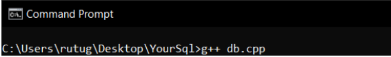
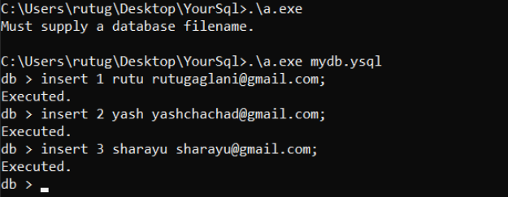
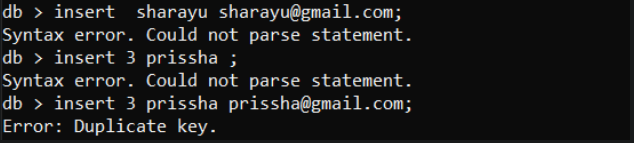
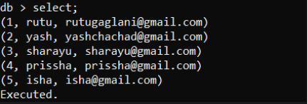
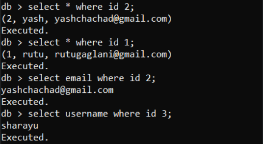
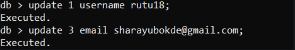
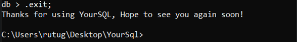
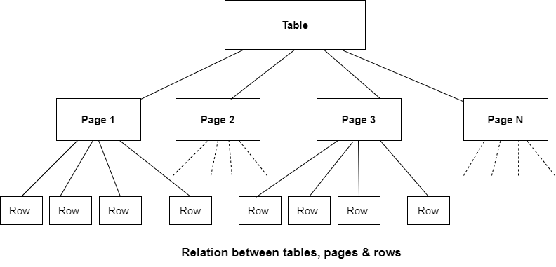

<!-- PROJECT SHIELDS -->
<!--
*** https://www.markdownguide.org/basic-syntax/#reference-style-links
-->
<!-- PROJECT LOGO -->

<br />
<p align="center">
  <a href="https://github.com/yash-chad/YourSQL/">
    
  </a>

  <h2 align="center">YourSQL!</h2>

  <p align="center">
    An in-process DBMS that implements a self-contained, minimal-configuration, transactional SQL database engine!
    <br />
    <a href="https://github.com/yash-chad/YourSQL"><strong>Explore the docs »</strong></a>
    <br />
    <br />
    <a href="https://github.com/yash-chad/YourSQL">View Demo</a>
    ·
    <a href="https://github.com/yash-chad/YourSQL/issues">Report Bug</a>
    ·
    <a href="https://github.com/yash-chad/YourSQL/issues">Request Feature</a>
  </p>
</p>

<!-- TABLE OF CONTENTS -->
<details open="open">
  <summary>Table of Contents</summary>
  <ol>
    <li>
      <a href="#about-the-project-✅">About The Project</a>
       <ul>
        <li><a href="#working-💻">Working</a></li>
      </ul>
       <ul>
        <li><a href="#built-with-🔨">Built with</a></li>
      </ul>
      <ul>
        <li><a href="#architecture-👷">Architecture</a></li>
      </ul>
    </li>
    <li>
      <a href="#getting-started-💥">Getting Started</a>
      <ul>
        <li><a href="#prerequisites">Prerequisites</a></li>
        <li><a href="#installation">Installation</a></li>
      </ul>
    </li>
    <li><a href="#contributing-🤝">Contributing</a></li>
    <li><a href="#developed-with-❤️-by">Developed with ❤️ by</a></li>

  </ol>
</details>

<!-- ABOUT THE PROJECT -->

## About The Project :white_check_mark:

As a developer we use databases all the time, but they were always a black box for me. This was an attempt to actually understand databases, how they work internally and many more things!

### Here's what we learnt/explored during the course of the project: :smile:

- What data structures are used by databases internally? and Why?
- What format is data saved in?
- How do databases process queries efficiently?
- How are indexes formatted?
- When does data move from memory to disk?

#### In short, how do databases work!

### Working :computer:

- Compile the db.cpp file.

  

- Enter the name of database during runtime. If the database already exists then it will load the file or else it will create a new file.

- **Insert Clause**

  ```SQL
  INSERT id, username, email;
  ```

  
  **Note :** If the query syntax is not followed it throws a syntax error.
  Note: The column “id” is the primary key and therefore has to be unique. If the id is repeated the database will throw an error.
  

- **Select Clause**<br/>
  To select all rows in a table :

  ```SQL
  SELECT;
  ```

  

  To query a particular row/attribute :

  ```SQL
  SELECT *column*  WHERE *column* *column-value*;
  ```

  

- **Update Clause**

  Updates a particular column value inside a row in the table.

  ```SQL
   UPDATE id column_name new_value;;
  ```

  

- **Exit Statement**

  Closes the connection to the database and writes the updates(if any) to the database file.
  

### Built With :hammer:

The entire project was written in C++ for performing fast and efficient database queries.

- [C++](https://www.cplusplus.com/)

### Architecture :construction_worker:

The entire architecture of a DBMS is broken down into 4 major parts:

1. The core
2. SQL Compiler
3. Backend
4. Accessories


### 1. The core

- The Core consists of Interface, SQL Command Processor and Virtual Machine.

- Interface is a medium by which the user will interact with the database through SQL
  queries.
- SQL Command Processor redirects the query to the SQL compiler
- Virtual machines interact with the core/backend of the database system.

### 2. SQL Compiler

- The SQL Compiler consists of Tokenizer, Parser and Code Generator.
- Tokenizer breaks the inputted SQL query into tokens and forwards it to the parser.
- Parser assigns meaning to tokens based on their context and assembles them into a parse
  tree. It checks the correctness of the syntax, if correct then it redirects/calls the routines that
  are expected to be performed.
- Code Generator runs to analyze the parse tree and generate bytecode that performs the
  work of the SQL statement.

### 3. Backend

- The Backend consists of B+ Trees, Pager and OS Interface.
- B+ Trees is the internal data structure that will be used to store the pages inside the
  database.
- Pager: Every table is broken down into pages and internally each page is made up of rows.



A row is nothing but a database entry. The pager does the function of breaking down the
rows into pages, gives the page number from the row number, etc.

- OS interface handles the task of reading/writing data from the database file stored in the
  system.

### 4. Accessories

- The Accessories consists of Utilities and Test Code.
- Utilities: Memory allocation, caseless string comparison routines, portable text-to-number
  and conversion routines are included under utilities. Symbol tables used by the parser are
  maintained by hash tables in utilities.

<!-- GETTING STARTED -->

## Getting Started :boom:

To get a local copy up and running follow these simple example steps:

### Prerequisites

To get started you need to have `G++ compiler` installed on your machine. You can download it from [Here](https://sourceforge.net/projects/mingw-w64/).

<!-- - npm
  ```sh
  npm install npm@latest -g
  ``` -->

### Installation

1. Clone the repo
   ```sh
   git clone https://github.com/yash-chad/YourSQL.git
   ```
2. Compile the source file
   ```sh
   g++ db.cpp
   ```
3. Run the generated execulatbe file `db.exe`.
   ```cpp
   ./a.exe db.ysql
   ```
   **_Note_** : You need to mention the name of the database file you wish to use. The file will get created if it does not already exists.

<!-- CONTRIBUTING -->

## Contributing :handshake:

Contributions are what make the open source community such an amazing place to be learn, inspire, and create. Any contributions you make are **greatly appreciated**.

1. Fork the Project
2. Create your Feature Branch (`git checkout -b feature/AmazingFeature`)
3. Commit your Changes (`git commit -m 'Add some AmazingFeature'`)
4. Push to the Branch (`git push origin feature/AmazingFeature`)
5. Open a Pull Request

<!-- CONTACT -->

## Developed with :heart: by

**_Yash Chachad_** - [Github](https://github.com/yash-chad) - chachadyash786@gmail.com

**_Rutu Gaglani_** - [Github](https://github.com/rutugaglani) - rutugaglani@gmail.com

**_Sharayu Bokde_** - [Github](https://github.com/SharayuBokde) - bokde.sharayu@gmail.com
